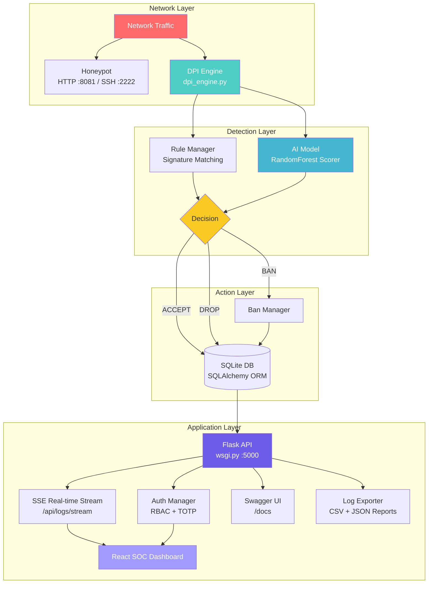

<p align="center">
  
</p>

<h1 align="center">vGuard</h1>

<p align="center">
  <strong>Virtualized Intrusion Detection &amp; Prevention System</strong>
</p>

<p align="center">
  <a href="https://github.com/EmirEvren/vGuard/actions/workflows/ci.yml"></a>
  <a href="#features"></a>
  <a href="#features"></a>
  <a href="#features"></a>
  <a href="#features"></a>
  <a href="#features"></a>
  <a href="LICENSE"></a>
</p>

<p align="center">
  A software-based IDS/IPS platform for virtualized and production cloud network environments.<br/>
  Combines deep packet inspection, rule-based signatures, AI-powered anomaly detection,<br/>
  honeypot traps, and a real-time SOC dashboard — all in a single deployable stack.
</p>

---

## Table of Contents

- [Overview](#overview)
- [Architecture](#architecture)
- [Features](#features)
- [Project Structure](#project-structure)
- [Quick Start](#quick-start)
- [Demo Credentials](#demo-credentials)
- [API Endpoints & Swagger Docs](#api-endpoints--swagger-docs)
- [Documentation](#documentation)
- [Contributing](#contributing)
- [License](#license)

---

## Overview

**vGuard** is a full-stack Intrusion Detection and Prevention System platform. It demonstrates a hybrid detection/prevention pipeline:

```
Network Traffic ──► DPI Engine ──► Rule Matching + AI Scoring ──► ACCEPT / DROP / BAN
                                                                        │
                    Honeypot Traps ◄──────────────────────────────────────┘
                         │                                              │
                    Interaction Logs                              SOC Dashboard
                                                              (Real-time SSE Stream)
```

1. Traffic hits the protected service or honeypot traps
2. **DPI Engine** inspects TCP packets using platform-native interception (NFQUEUE on Linux, WinDivert on Windows)
3. **Rule-based signatures** and **AI scoring** (RandomForest) classify each packet
4. Engine logs `ACCEPT` / `DROP` / `BAN` decisions to relational SQLite and broadcasts over Server-Sent Events (SSE)
5. **Flask API** serves the SOC dashboard, user management, and analytics with OWASP security headers
6. **React Dashboard** provides real-time SSE visualization, interactive charts, ban management, and reporting

---

## Architecture



---

## Features

### Detection & Prevention
- **Deep Packet Inspection** — Platform-native interception via NFQUEUE (Linux) or WinDivert (Windows)
- **Signature-Based Detection** — SQL injection, XSS, path traversal, command injection, scanner fingerprints, malware indicators
- **AI Anomaly Scoring** — Scikit-learn RandomForest model with configurable thresholds
- **Automatic IP Banning** — Temporary bans with manual unban workflow and strict `ipaddress` validation
- **Live Rule Reload** — Update detection rules without restarting the engine

### SOC Dashboard
- **Real-time Live Stream** — Server-Sent Events (SSE) `/api/logs/stream` for instant live packet display
- **Interactive Charts** — Real-time donut and bar charts for severity distribution and module activity
- **Threat Remediation AI** — Gemini AI and heuristic analysis providing actionable remediation plans
- **Attack Simulator** — 18 safe attack simulation modules (Web, Network, API, Cloud)
- **Ban Management** — View active bans, unban IPs, review ban history
- **User Management** — Role-based access control (Admin / Analyst / Viewer)
- **Mobile Responsive** — Adaptive layout with complete mobile navigation support

### Honeypot Services
- **HTTP Honeypot** — Trapping fake web requests on port 8081
- **Fake SSH** — Simulated SSH service on port 2222 logging unauthorized connection attempts

### Security & Architecture
- **Enterprise Architecture** — SQLAlchemy ORM with SQLite, modular Blueprints and service layer
- **OWASP Security Headers** — `X-Content-Type-Options`, `X-Frame-Options`, `X-XSS-Protection`, `Referrer-Policy`, `Permissions-Policy`
- **System Health Probe** — `/api/health` providing database connectivity, table record counts, and disk metrics
- **Interactive API Documentation** — Swagger UI at `/docs` and OpenAPI 3.0 specification at `/api/spec.json`
- **Rate Limiting & Lockout** — Brute-force protection with account lockout
- **Automated CI/CD** — GitHub Actions testing across Python 3.11 and 3.12 (20/20 tests passing)

---

## Project Structure

```
vGuard/
│
├── app/                          # Modular Flask Application Factory
│   ├── __init__.py               # create_app(), blueprints, security headers
│   ├── config.py                 # Development, Testing, Production configurations
│   ├── extensions.py             # SQLAlchemy, Migrate, CORS instances
│   │
│   ├── models/                   # SQLAlchemy ORM Models
│   │   ├── user.py               # User authentication & RBAC permissions
│   │   ├── ban.py                # IP ban records & firewall status
│   │   ├── event.py              # IDS/IPS security events & resolution
│   │   ├── audit.py              # System audit trail logs
│   │   ├── rule.py               # Threat detection signatures
│   │   ├── ip_risk.py            # Real-time IP risk scoring
│   │   └── setting.py            # Key-value persistent settings
│   │
│   ├── api/                      # Blueprint Controllers
│   │   ├── auth.py               # Login, logout, session verification
│   │   ├── users.py              # User CRUD & enable/disable
│   │   ├── profile.py            # Profile & password management
│   │   ├── events.py             # Event querying, filtering, SSE stream & export
│   │   ├── bans.py               # IP ban creation and unbanning
│   │   ├── rules.py              # Signature rules management & reset
│   │   ├── reports.py            # Audit & runtime evaluation reports
│   │   ├── settings.py           # Gemini AI & Email settings
│   │   ├── status.py             # Engine status & /api/health probe
│   │   ├── docs.py               # Swagger UI (/docs) & OpenAPI 3.0 spec
│   │   ├── analysis.py           # Gemini AI threat analysis (/api/analyze)
│   │   └── simulator.py          # 18 test attack probes (/api/simulate)
│   │
│   ├── services/                 # Domain Business Logic Layer
│   │   ├── auth_service.py       # User auth & management
│   │   ├── ban_service.py        # Ban operations & strict IP validation
│   │   ├── event_service.py      # Event queries, SSE broadcasting & resolve
│   │   ├── rule_service.py       # Rule persistence & reload
│   │   ├── audit_service.py      # Audit logging queries
│   │   ├── export_service.py     # CSV & JSON report generation
│   │   └── migration_service.py  # JSON to SQLite data migration
│   │
│   └── utils/                    # Decorators & Security Helpers
│       ├── decorators.py         # @require_login, @require_permission
│       └── security.py           # Client IP, password strength, rate-limiting
│
├── wsgi.py                       # WSGI entry point (Gunicorn / Waitress)
├── manage.py                     # CLI management tool (init-db, seed, migrate)
├── Dockerfile                    # Containerization definition
├── docker-compose.yml            # Multi-container orchestration
├── tests/                        # Pytest Test Suite (20/20 passing)
│   ├── conftest.py               # Test fixtures & in-memory DB
│   └── test_api.py               # Comprehensive endpoint tests
│
├── dpi_engine.py                 # Deep Packet Inspection / IDS/IPS engine
├── honeypot.py                   # HTTP & fake SSH honeypot services
├── ai_trainer.py                 # Machine learning training module (RandomForest)
├── ensure_vguard_ai_model.py     # Model verification and bundle loader
├── RUN_AI_EVALUATION.py          # AI performance evaluation runner
│
├── vguard_rules.json             # Default detection rule signatures
├── vguard.env.example            # Environment configuration template
├── requirements.txt              # Production Python dependencies
├── LICENSE                       # MIT License
│
├── docs/                         # Technical documentation
│   ├── RUNBOOK.md
│   ├── SECURITY_HARDENING_GUIDE.md
│   ├── MININET_LAB_GUIDE.md
│   └── ...
│
└── frontend/                     # Modular React + Vite SOC Dashboard
    ├── package.json
    ├── vite.config.js
    └── src/
        ├── App.jsx               # Router & state orchestration (<150 lines)
        ├── api.js                # Authenticated API client
        ├── components/           # Shell, Panel, StatCard, LoginScreen
        ├── tabs/                 # Individual modular tabs (Dashboard, Analysis, Bans, etc.)
        ├── utils/                # Helpers, chart colors, permissions
        └── i18n/                 # TR/EN translation dictionaries
```
```

---

## Quick Start

### Prerequisites

- **Python 3.10+**
- **Node.js 18+** (for frontend development)
- **Linux**: `iptables`, `libnetfilter-queue-dev` (for NFQUEUE)
- **Windows**: Administrator privileges (for WinDivert)

### 1. Clone & Setup

```bash
git clone https://github.com/EmirEvren/vGuard.git
cd vGuard
```

### 2. Python Environment

<details>
<summary><strong>Linux / macOS</strong></summary>

```bash
python3 -m venv .venv
source .venv/bin/activate
pip install --upgrade pip
pip install -r requirements.txt
```

For NFQUEUE packet interception support:
```bash
sudo apt update
sudo apt install -y python3-venv python3-pip iptables libnetfilter-queue-dev libnfnetlink-dev
```

</details>

<details>
<summary><strong>Windows (PowerShell)</strong></summary>

```powershell
py -m venv .venv
.\.venv\Scripts\Activate.ps1
python -m pip install --upgrade pip
python -m pip install -r requirements.txt
```

</details>

### 3. Database Initialization & Seeding

```bash
# Initialize SQLite database schema
python manage.py init-db

# Seed default users (admin, analyst, viewer) and 200+ detection rules
python manage.py seed
```

### 4. Run Automated Tests

```bash
python -m pytest tests/ -v
```

### 5. Launch Services

Open separate terminals:

```bash
# Terminal 1 — Backend API
python wsgi.py

# Terminal 2 — Honeypot
python honeypot.py

# Terminal 3 — DPI Engine (run as Admin/root)
# Linux:
sudo .venv/bin/python dpi_engine.py --queue-num 1 --test-port 8081 --auto-rules --log-accepted
# Windows:
python dpi_engine.py --log-accepted
```

Or run directly with **Docker Compose**:

```bash
docker compose up --build
```

### 6. Open Dashboard

Navigate to **http://127.0.0.1:5000/login** in your browser.

---

## Demo Credentials

| Role | Username | Password |
|------|----------|----------|
| **Admin** | `admin` | `Vg!2026-Secure#A1` |
| **Analyst** | `analyst` | `Vg!2026-Analyze#B2` |
| **Viewer** | `viewer` | `Vg!2026-View#C3` |

> Default accounts are auto-generated by `auth_manager.py` on first run if no user file exists.

---

## API Endpoints & Swagger Docs

Interactive Swagger UI documentation is available at **`/docs`** when running the server. The OpenAPI 3.0 specification is available at **`/api/spec.json`**.

| Method | Endpoint | Description |
|--------|----------|-------------|
| `GET` | `/docs` | Interactive Swagger UI API documentation |
| `GET` | `/api/spec.json` | OpenAPI 3.0 specification |
| `GET` | `/api/health` | System health probe (DB, record counts, disk space) |
| `GET` | `/api/status` | Engine heartbeat & uptime status |
| `POST` | `/api/auth/login` | Authenticate user & start session |
| `POST` | `/api/auth/logout` | Terminate active user session |
| `GET` | `/api/me` | Current authenticated user context & permissions |
| `GET` | `/api/logs` | Fetch IDS/IPS security logs (with search, category, time filters) |
| `GET` | `/api/logs/stream` | Server-Sent Events (SSE) live event stream |
| `POST` | `/api/logs/<id>/resolve` | Mark security alert as resolved |
| `POST` | `/api/logs/<id>/unresolve`| Restore resolved alert back to active feed |
| `GET` | `/api/logs/export.csv` | Stream CSV export of security events |
| `GET` | `/api/bans` | List active and historical IP bans |
| `POST` | `/api/bans` | Add manual IP ban with expiration |
| `POST` | `/api/bans/<ip>/unban` | Remove active IP ban and flush firewall |
| `GET` | `/api/users` | List all system users (Admin only) |
| `POST` | `/api/users` | Create new system user (Admin only) |
| `PATCH`| `/api/users/<username>` | Update user profile, role, or credentials |
| `GET` | `/api/rules` | List active DPI signature detection rules |
| `POST` | `/api/rules` | Update signature rules with hot-reload |
| `POST` | `/api/rules/reset` | Reset detection rules to built-in defaults |
| `POST` | `/api/analyze` | AI threat analysis with remediation steps (Gemini AI) |
| `POST` | `/api/simulate` | Execute controlled, non-destructive attack simulation |
| `GET` | `/api/reports/audit` | Fetch system audit trail logs |
| `GET` | `/api/reports/evaluation` | Fetch runtime performance evaluation metrics |
| `GET` | `/api/settings/gemini` | Get Gemini AI configuration status |
| `POST` | `/api/settings/gemini` | Configure Gemini AI API key |

---

## Documentation

Detailed guides are available in the [`docs/`](docs/) directory:

| Guide | Description |
|-------|-------------|
| [Runbook](docs/RUNBOOK.md) | Step-by-step operations guide |
| [Security Hardening](docs/SECURITY_HARDENING_GUIDE.md) | Production security recommendations |
| [Mininet Lab](docs/MININET_LAB_GUIDE.md) | Virtual network testing with Mininet |
| [KVM Deployment](docs/KVM_MININET_DIGITALOCEAN_RUNBOOK.md) | Cloud deployment with KVM/QEMU |
| [AI Evaluation](docs/AI_EVALUATION_GUIDE.md) | AI model evaluation methodology |
| [Rule Live Reload](docs/RULE_LIVE_RELOAD_GUIDE.md) | Hot-reload detection rules |

---

## Contributing

1. Fork the repository
2. Create your feature branch (`git checkout -b feature/amazing-feature`)
3. Commit your changes (`git commit -m 'Add amazing feature'`)
4. Push to the branch (`git push origin feature/amazing-feature`)
5. Open a Pull Request

---

## License

This project is licensed under the MIT License — see the [LICENSE](LICENSE) file for details.
